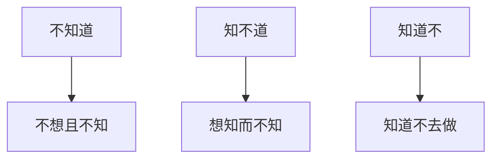

# 前言

---

> 有善始者实繁，能克终者盖寡。岂取之易而守之难乎？  
> ——魏征《谏太宗十思疏》

# 背景

---

受 1874 博主的影响， 结合自己的工作生活体会，按照自己设计的生活方式去生活是非常困难的。这其中有诸多影响因素。

从很久以前，哲人就告诉我们要探知自我，剖析自我，实际上这个想法基于的假设是自我是能动的，内在的精神世界是充盈的。而根据我的体会，至少我是非能动的，自我驱动能力是比较弱的，内在的精神世界比较贫瘠，受干扰和抵抗能力比较弱。

# 问题的提出

---

从不知道-->知不道-->知道不三个维度来分析，第一种面对未知的事物，不想且不知是愚蠢的。因为只有在运动中才能维持相对静止，身处桃花源有可能会被现实扬弃。

第二种知不道是受客观条件制约，并不是所有的路都是别人给我们铺好的，工作中的技巧也不是一入职就会的，知不道本身就是一宗能量差，需要我们花时间和经历去学习和适应。

第三种知道不，知道而不去做，这种其实是比较可悲的，知道熬夜伤身体却不去避免，知道年轻的时候应该学习却沉迷娱乐。

那么问题的症结到底在哪里呢？

# 分析问题

---

- 工作与生活方法论的割裂

常年受填鸭方式的影响，已经习惯被动地接受各种任务的安排，而缺乏积极主动的能力，更谈不上创造性，所带来的意义确实也成为附加影响，自我康复的周期也比较漫长，难度也比较高。

而工作与生活观上的割裂，导致一直摆脱不了填鸭的诅咒，具体表现为：工作上进，生活懒散，实际上，久而久之，这就会成为一个风险项，若无生活，则很难在学习能力上有较大的提升，也很难用在工作实践上，自学能力也会受到限制。

追求低水平的娱乐导致时间被浪费，在较高节奏的工作状态中会导致疲惫的累积，从而埋下风险的种子。

# 问题解决方案的设计

---

事实上，尽管问题重重，但还不至于山穷水尽，积重难返的地步，仍然还是有一些优秀的经验被传承下来用于问题的解决。

- 规定范式，保证节点

任何一种状态都依托时间，抛开时间谈问题大概率是耍流氓。尽管在[《流浪者之歌》](notion://www.notion.so/fragrantknowledge/5d4c37e1f5f84d2c91394b0151344f1e)中也提出时间本不存在这一观念，但面对公众的共识，我仍将其视为一项基本准则。

例如八点上下班，保证 7-9h 的睡眠就是首要任务，在 23 点之前入睡已经是一项基本常识，而从高中始就引出另外两个问题：压力水平和情绪管理。若不解决这两个问题，很难保证节点。这两个问题也将贯穿我们的一生。此方面，我给出的设计方案是减少人为因素在控制过程中的参与比，通过机器协助来更好地达成目标。我不否认强者有极强的自制能力，但作为弱者寻求自救亦不可耻。学习 crontab+mailx 搭建提醒流程配合 ios 的自动化进行节点提示是一个不错的辅助方案。

- 建筑精神之家

如果你没有合适的家人、爱人、朋友可以倾诉。不要紧，寻求精神价值和分流的方式也有很多，也有可以提供相近感受的解决方案，但选择一个符合价值观的导向是有必要的，尽管可以通过非正常的方式达到同样的效果，但不作为我们的最佳实践。同样地，我们可以做一些有趣的事情，转换为对于知识技能和文学修养的累积，或规划次日的生活，或归档一天的情绪，记录到 flomo 中。

对相知相守的美好愿望，鼓舞着我们努力向上。而关爱自我，延续自我亦未尝不是在这个阶段到来前的最佳选择。面的复杂的环境和高昂的代价，以退为进是一个审慎的选择，首先是为自己而活，其次才是除自己以外的人而活。不珍重自我，如何珍重别人。爱不应该带有附加价值的回报。

培养爱的艺术，总结此去二十年的人生历程，也是一个值得关注的方面，每天都有非常多的时刻，可以让我们学习进步。

- 习惯与反直觉

加班愚蠢？摸鱼有罪！我们倾向于接受符合大众直觉的观念，但一些观念往往值得推敲，周五的放纵看似合理，实则会牺牲周六上午的时间，那么周六上午去工作写周志，就会倒逼周五做合理的休息，留出一段时间来反思总结，未尝不是一种智慧。

# 总结

---

取易守难，就要知难守易，生活范式的优化问题始终值得思考，尤其是在新旧交替的人生阶段，必定会遇到很多的困难和挫折，兼听多方意见，结合自身体会，正视过往缺点，才能从泥泞中走出迷雾。

## 附件

---

# 特别鸣谢

---

- [月刊（第 1 期）：刻意练习 • 1874's BLOG](https://blog.1874.cool/2024-month-01)
- [☕️ 关于这里 | flomo 101 (flomoapp.com)](https://help.flomoapp.com/about-101.html)
- [安达维尔 (andawell.com)](http://www.andawell.com/)
