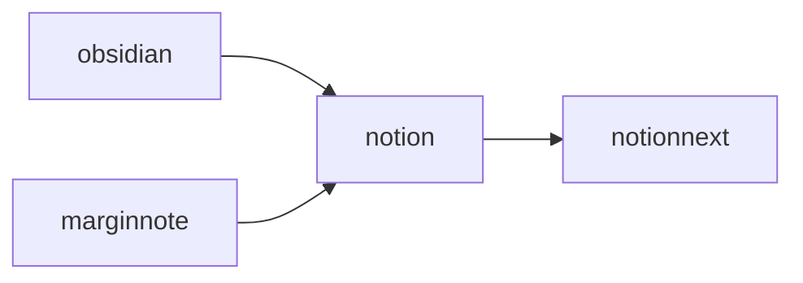
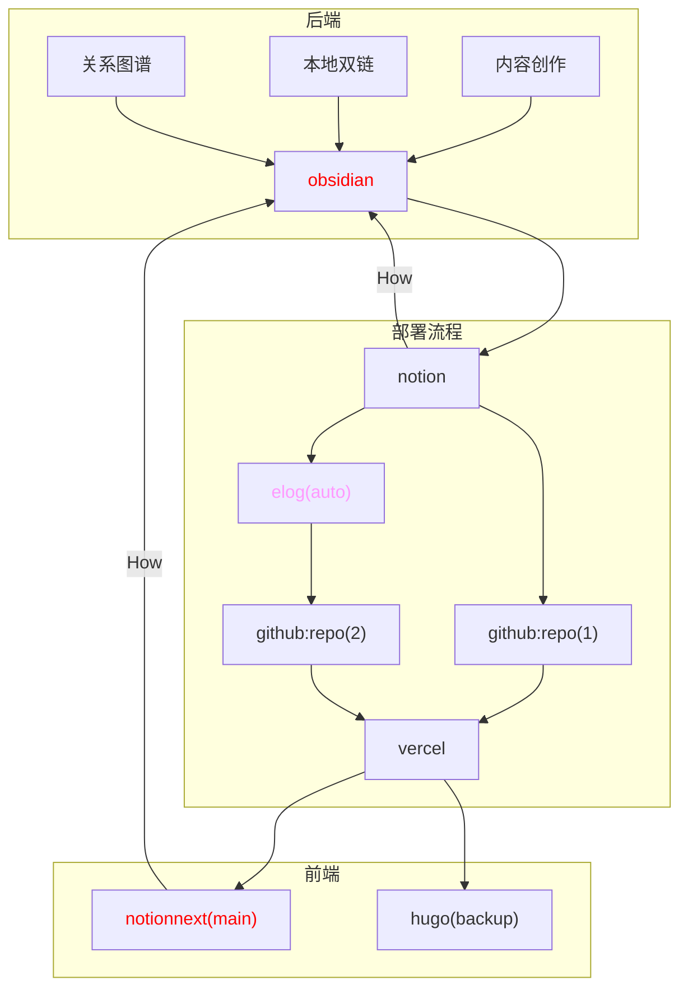
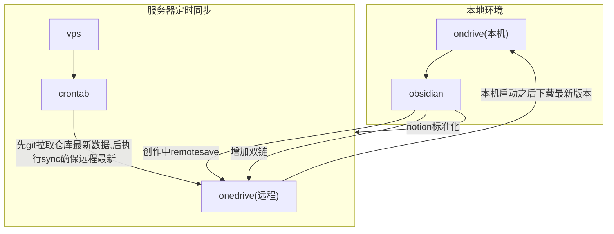
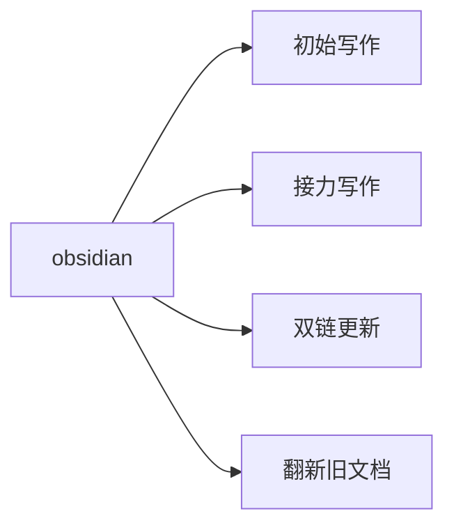

# 更新log


---


  之前我一致在思考如何对于文章进行纵向管理，可以说，也正是这个念头，才产生了这篇文章，当我再去思考纵向管理的时候，它核心的定义是什么的时候，我认为可以这么来理解，即**“站在过去自己的肩膀上”**，为了避免重复造轮子，从而节约时间和精力能去做更多有意义的事情。
  同时，我们还应该清楚地认识到，每一个开始，都是要付出不下的决心和代价，如果每次想到同一个问题的时候都需要在原地踏步，甚至重新思考，我认为这种模式是低效的，正如同，我们学过了大学的知识，但是在之后运用中却不得不花费时间自己再去学一遍。从结果导向来看，这种结果是不尽如人意的。那么我们就需要反思问题出在哪里。
  如果再往前追溯，我们甚至还可以想到我们的高中，但是那个时候大部分的知识都忘掉了，我们翻看过去的笔记的概率无限接近于零，因为当下有更多要紧的事情要去完成。所以，电子化时代确实是带来了这个问题解决的思路和可能。
  当然理论部分，我觉得不应该再花时间做过多的解释和强调了。


### 更新视频讲解 2024-03-23 


---


[[数据中心] 测试crontab同步elog+Onedrive_哔哩哔哩_bilibili](https://www.bilibili.com/video/BV1DA4m1P7J9/?spm_id_from=333.999.0.0&vd_source=237e295a40d7aaea043ead8c0d2c78ab)


### 关于服务器同步原理的更新 2024-03-02 


---

- cron在执行elog指令的时候存在困难，**需要配置一些环境变量**，在折腾之后，并没有成功。

```shell
在 Linux 系统中，cron 任务是在一个相对干净的环境中执行的，通常缺少一些常见的环境变量。这可能导致在 cron 任务中无法访问一些用户环境中可用的变量或路径。下面是一些关于 cron 运行环境的重要信息：
1. PATH 环境变量：
   cron 任务运行时通常只包含一个非常基本的 PATH 环境变量，这可能导致在 cron 任务中无法直接调用系统中的一些命令或程序。为了解决这个问题，你可以在 crontab 任务中显式设置 PATH 环境变量，或者在命令中使用绝对路径来调用命令。
2. 当前工作目录：
   cron 任务的默认工作目录通常是用户的家目录。因此，如果你的任务需要在特定目录中执行，最好在 crontab 任务中使用 `cd` 命令切换到正确的工作目录。
3. 标准输入和标准输出：
   cron 任务通常没有与终端相关联的标准输入和标准输出。如果任务产生输出，最好将输出重定向到文件中，以便后续查看。
4. 环境变量：
   cron 任务通常缺少用户登录时设置的环境变量，包括一些自定义的 PATH、LD_LIBRARY_PATH 等。为了在 cron 任务中使用这些环境变量，你可以在任务中加载包含这些变量的文件，比如使用 `source` 命令加载一个包含环境变量设置的脚本。
5. 日志记录：
   为了方便排查问题，建议在 crontab 任务中将输出和错误信息重定向到日志文件中。这样可以帮助你在任务执行时查看输出信息以及任何错误。
总的来说，要确保 cron 任务能够正常执行，最好在编写任务时考虑到这些环境限制，并相应地设置环境变量、工作目录和输出记录方式。
```

- 在[CC康纳百川](/9f509fa3f0c941b0b86a3a8a61b86b50)的提醒下，打算使用git拉取仓库的代码，因为仓库的数据一直都是最新的。经过本地和远程测试，可以成功被执行。操作步骤如下：

```shell
如果你想拉取整个 GitHub 存储库中的特定文件夹，可以使用 Git 工具来克隆该存储库，并在本地保留所需的文件夹。这种方法可以通过 Git 的子模块或者使用 sparse checkout 功能来实现。
以下是一个示例，展示如何使用 Git 克隆整个 GitHub 存储库并只保留特定文件夹的内容：
1. 首先，克隆 GitHub 存储库到本地。假设你已经安装了 Git：
git clone <repository_url>
请将 `<repository_url>` 替换为 GitHub 存储库的 URL。
2. 进入克隆的存储库目录：
cd repository_name
请将 `repository_name` 替换为你克隆的存储库的名称。
3. 使用 sparse checkout 功能来只保留特定文件夹的内容。首先启用 sparse checkout：
git config core.sparsecheckout true
4. 然后，指定要保留的文件夹路径。编辑 `.git/info/sparse-checkout` 文件，将需要的文件夹路径添加到文件中：
echo "folder_path/*" >> .git/info/sparse-checkout
请将 `folder_path` 替换为你想要保留的文件夹路径。
5. 最后，更新工作区以应用 sparse checkout：
git read-tree -mu HEAD
现在，你的本地存储库中应该只包含特定文件夹的内容。
这种方法允许你克隆整个 GitHub 存储库，并只保留特定文件夹的内容，而不是整个存储库。

如果你已经使用 sparse checkout 将特定文件夹的内容克隆到本地，并且想要更新这个文件夹以获取最新的更改，你可以执行以下命令：
1. 首先，确保你在存储库的根目录中。
2. 拉取存储库的最新更改：
git pull
这将拉取存储库的最新更改。
3. 如果你只想更新特定文件夹而不是整个存储库，可以执行以下命令：
git checkout HEAD folder_path
这将更新特定文件夹的内容以反映最新更改。
通过执行这些命令，你可以更新本地存储库中特定文件夹的内容，而不必拉取整个存储库的内容。
```


# 前言


---


  建立数据中心的意义：在建立知识体系的环节中，我们正确认识到人类的大脑无法保留过多的缓存，能保留的只能是方式，简而言之，我们无法保留文件的具体内容，更容易记得寻找文件的路径，基于此，数据中心的应运而生。


# 正文


---


  在寻求数据管理中出现了非常多优秀的软件，基于我目前的了解，使用git进行分布式管理是非常有效的方式和手段，作为开源社区的土壤，github为全世界的程序员提供了协作的机会，也是分布式数据中心成功的代表。我们可以从中学到很多有用的经验。


  另外，在数据管理中，时间的调度成为不可忽视的重要因素，日志作为过程记录和经验总结的重要经验来源，既承接着举足轻重的地位，又对时间的分配提出了较高的要求，因此，作为一种轻量标记语言的markdown成为log记录的优秀格式。保持高阅读性的同时，最大化地保留了日志的流畅性。


  另外，图表在文档介绍中也起到至关重要的作用，mermaid语法成为一种新型的，具备创造力的表现方式，衔接了文字与图片之间的关系，成为一些值得掌握的技能。


  与此同时，学会正则表达式，对于文档检索有很大的帮助，这对于精确检索数据提供了快捷有效的方式，obsidian的检索和脑图功能，提供了更简明的搜索技巧，但正则表达式仍然是一项值得学习的技能。


### 需求的提出


---


  我的需求来自于对于多设备之间数据管理的困扰，首先我们需要注意的一点是，我们的技能和工作效率很大程度上来自于学习的积累所得，但同样矛盾的地方在于学习积累的客观困难性，使得效率的提升和体验的优化成为一项极为困难的事情。因此，我们就如同推石头的西西弗斯，没办法用更加优化的方式和思维来进行学习方式和知识管理的优化。


## 思路的来源


---


  我们已经积累了一部分工作流的经验，如下图所示。





  其中，我主要通过，obsidian和marginnote来进行内容的梳理，我将简单介绍一下两个工具的特点，您也可以自行上网查询了解。


  obsidian作为md笔记中的佼佼者，凭借其优秀的特性，开源，丰富插件，双链，关系图谱，使之成为md笔记的最佳承载。


  marginnote作为苹果系统中的学习类软件，将笔记，标注，脑图，搜索一体化，结合社区的强大插件，使得学习得到最优体验。


  为什么选择notion，notion本身作为一款极为优秀的笔记管理软件，开启了自由笔记的先河，丰富的块理念和多种数据视图，使得知识管理可以更加富有层次化的呈现，集合管理与协作与一身，在线协作功能也非常出色。


  notionnext是由tangly开发的博客框架，可以将您在notion上的笔记变为博客进行渲染，使得知识分享更为便捷。让您在任何一台可以连接到互联网上的设备进行随时随地查看并分享给需要的人，同时可以让更多地人参与到对该话题的讨论。细化的功能，可以等到之后有时间的时候进行细讲。


## 前后端分离


---


  在上述的讨论过程中，我们发现，内容的创作是单向流动的，我们无法完成知识的反馈和纵向管理，那么就会导致知识的实时性受到极大的影响。


  那么，有没有什么办法可以解决这个问题。首先我们来看知识管理的总架构。





### 后端的组成


---


  后端主要依赖obsidian，在obsidian中进行如下工作：

- 内容的创作
- 关系图谱的梳理
- 通过图谱确认更新需求

### 部署流程


---


  通过obisidian完成内容的创作后输出到notion中进行标准化处理，所谓标准化处理，就是通过notion的数据数据库给文章分配属性，例如标准化标题、文章分组及标签分配。这些工作便于后续elog按照notion的字段进行对应组别的导出。


### 前端的组成


---


  目前前端的组成分为两个博客，NotionNext为主要架构，Hugo为容灾备份。用于分享交流。


## 数据中心的建立


---


  为了解决提出的需求，也就是上图所示的How的问题。我们打算采用vps中的定时脚本来为我们完成数据库的迁移。简明原理如下。





### 服务器同步模块之onedrive安装


---


  服务器您无需把它想得很高大上，它就像一台24小时开机的远程电脑，可以执行您的需求。基于此，一个好用的定时脚本可以为我们完成很多事情。


  第一步，我们通过进入服务器的终端。首先安装必要的远程仓库的组件。如何在ubuntu上安装onedrive，很感谢github为我们提供了onedrive的安装方式，具体的安装步骤需要您参考对应的[项目手册](https://github.com/abraunegg/onedrive/tree/master)。


  以下内容是对社区文档的转载。


  我的操作系统是ubuntu20.04，对应的安装步骤如下：

- 确认移除旧的客户端

```shell
sudo apt remove onedrive
sudo add-apt-repository --remove ppa:yann1ck/onedrive
```

- 此外，Ubuntu及其克隆在安装“onedrive”软件包时有创建“默认”系统服务文件的坏习惯，这样客户端将自动运行正在验证的客户端帖子。此系统条目是错误的，需要删除。

```shell
sudo rm /etc/systemd/user/default.target.wants/onedrive.service

```

- 使用类似于以下内容的脚本，以确保您的系统正确更新

```shell
#!/bin/bash
rm -rf /var/lib/dpkg/lock-frontend
rm -rf /var/lib/dpkg/lock
apt-get update
apt-get upgrade -y
apt-get dist-upgrade -y
apt-get autoremove -y
apt-get autoclean -y

```

- 确认您的操作系统，示例如下

```shell
alex@ubuntu-system:~$ lsb_release -a
No LSB modules are available.
Distributor ID: Ubuntu
Description:    Ubuntu 22.04 LTS
Release:        22.04
Codename:       jammy

```

- 选择对应的发行版（Ubuntu20.04）添加OpenSuSE Build Service存储库发布密钥

```shell
wget -qO - <https://download.opensuse.org/repositories/home:/npreining:/debian-ubuntu-onedrive/xUbuntu_20.04/Release.key> | sudo apt-key add -

```

- 添加OpenSuSE Build Service存储库

```shell
echo 'deb <https://download.opensuse.org/repositories/home:/npreining:/debian-ubuntu-onedrive/xUbuntu_20.04/> ./' | sudo tee /etc/apt/sources.list.d/onedrive.list

```

- 更新您的apt软件包缓存

```shell
sudo apt-get update

```

- 安装onedrive

```shell
sudo apt install --no-install-recommends --no-install-suggests onedrive
```

- 阅读并了解以下这些软件包的[已知问题](https://github.com/abraunegg/onedrive/blob/master/docs/ubuntu-package-install.md#known-issues-with-installing-from-the-above-packages)，采取任何需要的行动。

### 服务器同步模块之onedrive使用


---


  同样，您应该优先选择阅读项目文档，我的转载未必全面，同时如果转载过于消耗时间，那我将会省略该步骤。


  关于[onedrive](https://github.com/abraunegg/onedrive/blob/master/docs/USAGE.md)的使用如下：

- 授权，您将被要求使用网络浏览器打开特定的URL，您必须登录您的微软帐户，并授予应用程序访问文件的权限。授予应用程序权限后，您将被重定向到空白页面。将空白页面的URI复制到应用程序中。

```shell
[user@hostname ~]$ onedrive
Authorize this app visiting:
https://.....
Enter the response uri:
```

- 显示您的配置

```shell
onedrive --display-config
```

- 执行同步

```shell
onedrive --synchronize
```


  更多详细的步骤我将不再具体介绍，需要您阅读项目文档。


### 服务器同步模块之elog的环境配置


---


  这部分您需要参考两份文档，由于我之前已经写过关于elog的配置文档，将不再赘述。引用如下：

- [Elog开放式跨平台博客解决方案](https://elog.1874.cool/)
- [elog+notion实现md优雅备份](https://matrixcore.top/article/elog)

首先您需要阅读官方文档，其次您可以参考我的配置。


### 服务器同步模块之crontab定时脚本


---


  关于crontab定时脚本的功能非常丰富，我认为仍然有很多的玩法可以被开发。这里我主要是结合elog+onedrive来进行使用。


  当您在服务器上完成elog和onedrive的环境安装之后，您可以编写同步脚本。


```shell
00 12 * * *  cd /root/OneDrive/software/remotely-save/elog && elog sync -e .elog.env
02 12 * * *  onedrive --synchronize
```


  这段代码的意思就是每天中午12点执行一次elog同步，获取notion中的最新数据，过两分钟执行onedrive的主动同步，来保障远程仓库是最新的。（因为我不确定是否onedrive会自动同步，所以我选择了手动的方式。）


### 本地环境的使用说明


---


  在完成上述操作之后，当您打开一台新的设备，如果您的个人机器不在身边，过年了去哥哥姐姐外婆家串门，您就可以在新的设备当中，使用onedrive获取到远程仓库的最新文档。并在obsidian接力未完成的工作，使得假期不再无聊。


  那么，obsidian既可以进行文档的初始写作，也可以接力任何一台设备的中断写作。同样，建立双链之后也可以更新到远程仓库，完成文档的写作也可以进行标准化输出。也可以进行旧有文档的更新。





# 总结


---


  由于时间和精力的限制，今天的分享就到这里，因为内容太多了，也会非常疲惫。


## 附录


---

- 经测试nextcloud和onedrive同理，也可以在服务器上安装nextcloud客户端进行同步指令，remotesave也支持nextcloud的webdav，只不过配置稍微麻烦一点。
- 关于后端工作流的输入源的优化也是一个值得关注的问题。

## 致谢


---

- 🌺感谢1874博主对于本工作流的建议，同时提出了一篇值得参考的[文章](https://www.v2ex.com/t/1005055#reply27)
- 感谢一位博主提供的工作流图

	

