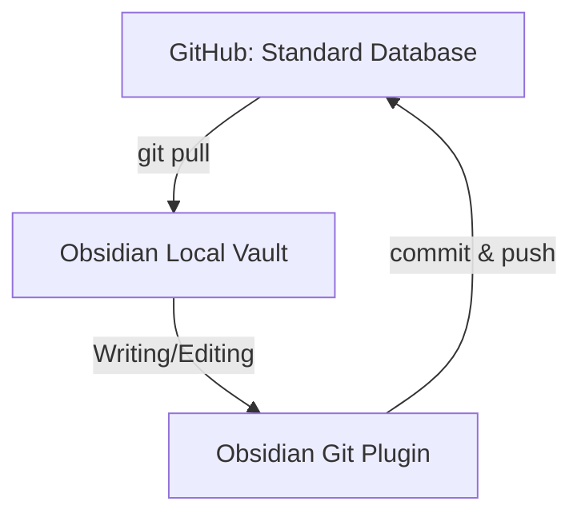

# 🏗️Background

---

We plan to establish three different types of databases to handle knowledge environments in different scenarios:

- The **standard database**, named `standard-db`, is used to record and revise historical experiences and knowledge conclusions.
- The **creative database**, named `creative-db`, is used for creating standardized NotionNext documents such as blogs and tutorials.
- The **workspace database**, named `workspace-db`, is used for managing work tasks and knowledge learning.

# 🧱Main Content

---

## 🔄 Building a Seamless Knowledge Workflow: From Obsidian to GitHub to Vercel

---

Let's first focus on maintaining the **standard database** — how to elegantly manage historical experiences in **Obsidian**, perform **`git pull`**, and ultimately use **GitHub Actions** to push updates to **Vercel**, enabling automatic backup and updates of **Hugo**. The workflow is illustrated in the Mermaid flowchart below:



By exploring the Obsidian plugin library, we identified a plugin that fits our needs: **Obsidian Git**. After reviewing its [📖 full documentation](https://publish.obsidian.md/git-doc), we confirmed that it supports all the essential features required for our workflow:

- **`git pull`**: Supports both **automatic** and **manual** pulling of remote updates.
- **`git push`**: Allows **automatic** or **manual** pushing of local changes to the remote repository.
- **`git commit`**: Supports **automatic** or **manual** commits of changes.
- **Conflict detection and handling**: The plugin does **not** auto-merge in the event of a conflict. Instead, it **notifies the user** to resolve conflicts manually.
- **Auto-sync intervals**: You can configure it to **automatically pull/push** at defined time intervals.
- **Sync on startup**: Automatically performs a `git pull` when Obsidian is launched.
- **Command palette integration**: All Git operations can be executed via Obsidian’s **command palette**, eliminating the need to use a terminal.

This plugin fully meets our basic requirements for maintaining the `standard-db` within Obsidian while seamlessly integrating with GitHub.

## 🧩 What Are Git Submodules Used For?

---

Git submodules allow you to **nest one Git repository inside another**, which is especially useful for:

- Referencing external dependencies (such as themes or libraries)
- Managing dependency versions independently
- Avoiding copy-pasting third-party code into your main repository

In **Hugo projects**, submodules are commonly used to include themes. For example:

```shell
git submodule add <https://github.com/reuixiy/hugo-theme-meme.git> blog/themes/meme
```

This command automatically updates the `.gitmodules` file and adds the theme as a submodule under version control.

If you decide **not to manage** **`blog/themes/meme`** **as a submodule**, you can simply delete the `.gitmodules` file and remove the submodule itself from your repository.

## 🧨Case: Why Sparse Checkout Didn’t Work as Expected

---

### 🎯Scenario

---

I ran the following commands:

```shell
git clone --filter=blob:none --sparse <https://github.com/xxx/elog.git>
cd elog
git sparse-checkout set content
```

I expected to fetch only the `content/` directory, but I still saw many other files in the root directory:

```shell
README.md
config.toml
package.json
*.config.js
package-lock.json
yarn.lock
```

### 🪤Root Cause

---

By default, Git uses **cone mode** for sparse-checkout. In this mode:

- It only supports directory paths
- It **does not exclude root-level files**, even if I didn’t specify them

So even though I only set `content/`, Git still checked out all the files in the root directory.

### ✅Correct Approach

To fetch only the `content/` directory and ignore everything else, I needed to switch to **non-cone mode**:

```shell
git sparse-checkout init --no-cone
git sparse-checkout set content/
```

This way, only the `content/` directory is checked out.

## 🧪 Final Fix (Step-by-Step Commands)

---

To fix the issue and fetch only the desired directory, you can copy and paste the following:

```shell
# Enter the repo
cd elog

# Clear previous sparse-checkout settings
git sparse-checkout disable

# Initialize sparse-checkout in non-cone mode
git sparse-checkout init --no-cone

# Specify the directory to include
echo "/content/" > .git/info/sparse-checkout

# Apply the sparse-checkout settings
git read-tree -mu HEAD

# Verify
ls
```

## 🛠️ Bonus: Fetch Multiple Directories

---

If you want to include more than one directory (e.g., `content/` and `docs/`), update the sparse-checkout file like this:

```shell
echo "/content/" > .git/info/sparse-checkout
echo "/docs/" >> .git/info/sparse-checkout
git read-tree -mu HEAD
```

This will fetch both `content/` and `docs/` directories, and nothing else.

# 🧾 Conclusion

---

By leveraging Git's sparse-checkout (in non-cone mode), submodules, and Obsidian Git integration, we can build a streamlined and efficient knowledge management workflow. This setup not only reduces unnecessary clutter in local environments but also ensures version-controlled, automated, and scalable updates across platforms like GitHub and Vercel. Whether managing historical knowledge, creating new content, or organizing workspaces, this approach provides a solid foundation for maintaining a clean and productive knowledge ecosystem.
