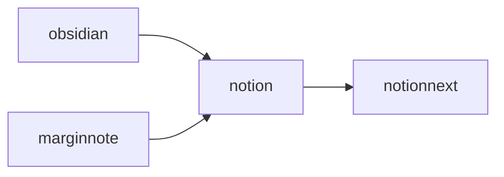
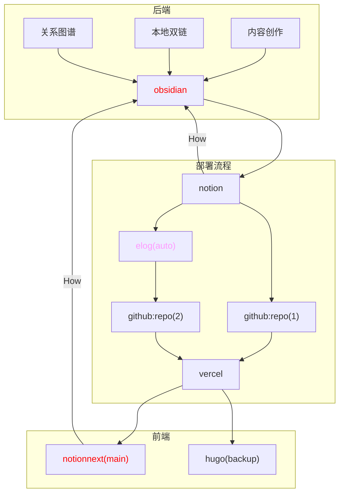
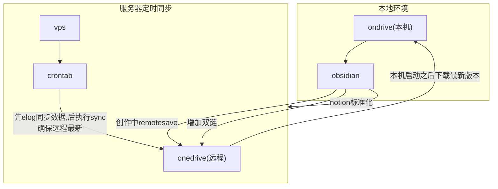
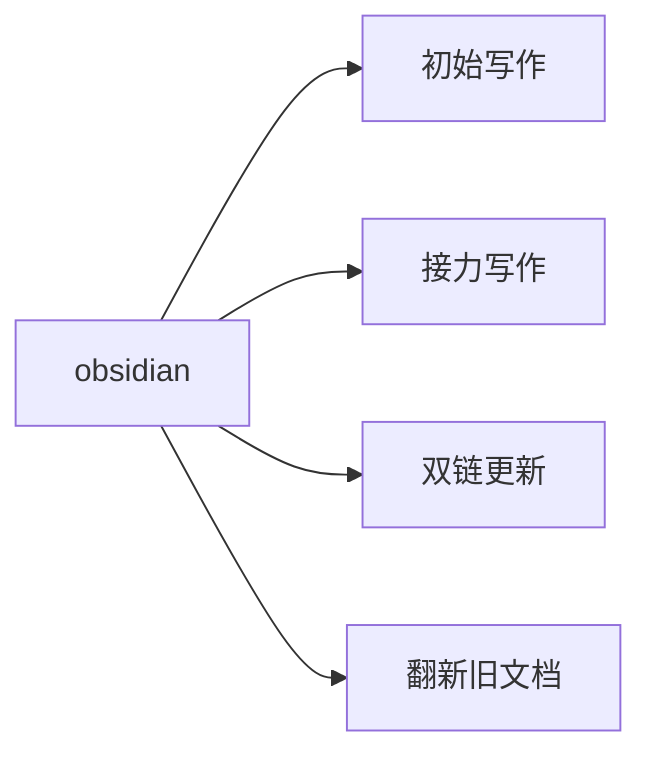

# 前言

---

建立数据中心的意义：在建立知识体系的环节中，我们正确认识到人类的大脑无法保留过多的缓存，能保留的只能是方式，简而言之，我们无法保留文件的具体内容，更容易记得寻找文件的路径，基于此，数据中心的应运而生。

# 正文

---

在寻求数据管理中出现了非常多优秀的软件，基于我目前的了解，使用 git 进行分布式管理是非常有效的方式和手段，作为开源社区的土壤，github 为全世界的程序员提供了协作的机会，也是分布式数据中心成功的代表。我们可以从中学到很多有用的经验。

另外，在数据管理中，时间的调度成为不可忽视的重要因素，日志作为过程记录和经验总结的重要经验来源，既承接着举足轻重的地位，又对时间的分配提出了较高的要求，因此，作为一种轻量标记语言的 markdown 成为 log 记录的优秀格式。保持高阅读性的同时，最大化地保留了日志的流畅性。

另外，图表在文档介绍中也起到至关重要的作用，mermaid 语法成为一种新型的，具备创造力的表现方式，衔接了文字与图片之间的关系，成为一些值得掌握的技能。

与此同时，学会正则表达式，对于文档检索有很大的帮助，这对于精确检索数据提供了快捷有效的方式，obsidian 的检索和脑图功能，提供了更简明的搜索技巧，但正则表达式仍然是一项值得学习的技能。

### 需求的提出

---

我的需求来自于对于多设备之间数据管理的困扰，首先我们需要注意的一点是，我们的技能和工作效率很大程度上来自于学习的积累所得，但同样矛盾的地方在于学习积累的客观困难性，使得效率的提升和体验的优化成为一项极为困难的事情。因此，我们就如同推石头的西西弗斯，没办法用更加优化的方式和思维来进行学习方式和知识管理的优化。

## 思路的来源

---

我们已经积累了一部分工作流的经验，如下图所示。



其中，我主要通过，obsidian 和 marginnote 来进行内容的梳理，我将简单介绍一下两个工具的特点，您也可以自行上网查询了解。

obsidian 作为 md 笔记中的佼佼者，凭借其优秀的特性，开源，丰富插件，双链，关系图谱，使之成为 md 笔记的最佳承载。

marginnote 作为苹果系统中的学习类软件，将笔记，标注，脑图，搜索一体化，结合社区的强大插件，使得学习得到最优体验。

为什么选择 notion，notion 本身作为一款极为优秀的笔记管理软件，开启了自由笔记的先河，丰富的块理念和多种数据视图，使得知识管理可以更加富有层次化的呈现，集合管理与协作与一身，在线协作功能也非常出色。

notionnext 是由 tangly 开发的博客框架，可以将您在 notion 上的笔记变为博客进行渲染，使得知识分享更为便捷。让您在任何一台可以连接到互联网上的设备进行随时随地查看并分享给需要的人，同时可以让更多地人参与到对该话题的讨论。细化的功能，可以等到之后有时间的时候进行细讲。

## 前后端分离

---

在上述的讨论过程中，我们发现，内容的创作是单向流动的，我们无法完成知识的反馈和纵向管理，那么就会导致知识的实时性受到极大的影响。

那么，有没有什么办法可以解决这个问题。首先我们来看知识管理的总架构。



### 后端的组成

---

后端主要依赖 obsidian，在 obsidian 中进行如下工作：

- 内容的创作
- 关系图谱的梳理
- 通过图谱确认更新需求

### 部署流程

---

通过 obisidian 完成内容的创作后输出到 notion 中进行标准化处理，所谓标准化处理，就是通过 notion 的数据数据库给文章分配属性，例如标准化标题、文章分组及标签分配。这些工作便于后续 elog 按照 notion 的字段进行对应组别的导出。

### 前端的组成

---

目前前端的组成分为两个博客，NotionNext 为主要架构，Hugo 为容灾备份。用于分享交流。

## 数据中心的建立

---

为了解决提出的需求，也就是上图所示的 How 的问题。我们打算采用 vps 中的定时脚本来为我们完成数据库的迁移。简明原理如下。



### 服务器同步模块之 onedrive 安装

---

服务器您无需把它想得很高大上，它就像一台 24 小时开机的远程电脑，可以执行您的需求。基于此，一个好用的定时脚本可以为我们完成很多事情。

第一步，我们通过进入服务器的终端。首先安装必要的远程仓库的组件。如何在 ubuntu 上安装 onedrive，很感谢 github 为我们提供了 onedrive 的安装方式，具体的安装步骤需要您参考对应的[项目手册](https://github.com/abraunegg/onedrive/tree/master)。

以下内容是对社区文档的转载。

我的操作系统是 ubuntu20.04，对应的安装步骤如下：

- 确认移除旧的客户端

```text
sudo apt remove onedrive
sudo add-apt-repository --remove ppa:yann1ck/onedrive
```

- 此外，Ubuntu 及其克隆在安装“onedrive”软件包时有创建“默认”系统服务文件的坏习惯，这样客户端将自动运行正在验证的客户端帖子。此系统条目是错误的，需要删除。

```text
sudo rm /etc/systemd/user/default.target.wants/onedrive.service

```

- 使用类似于以下内容的脚本，以确保您的系统正确更新

```text
#!/bin/bash
rm -rf /var/lib/dpkg/lock-frontend
rm -rf /var/lib/dpkg/lock
apt-get update
apt-get upgrade -y
apt-get dist-upgrade -y
apt-get autoremove -y
apt-get autoclean -y

```

- 确认您的操作系统，示例如下

```text
alex@ubuntu-system:~$ lsb_release -a
No LSB modules are available.
Distributor ID: Ubuntu
Description:    Ubuntu 22.04 LTS
Release:        22.04
Codename:       jammy

```

- 选择对应的发行版（Ubuntu20.04）添加 OpenSuSE Build Service 存储库发布密钥

```text
wget -qO - <https://download.opensuse.org/repositories/home:/npreining:/debian-ubuntu-onedrive/xUbuntu_20.04/Release.key> | sudo apt-key add -

```

- 添加 OpenSuSE Build Service 存储库

```text
echo 'deb <https://download.opensuse.org/repositories/home:/npreining:/debian-ubuntu-onedrive/xUbuntu_20.04/> ./' | sudo tee /etc/apt/sources.list.d/onedrive.list

```

- 更新您的 apt 软件包缓存

```text
sudo apt-get update

```

- 安装 onedrive

```text
sudo apt install --no-install-recommends --no-install-suggests onedrive

```

- 阅读并了解以下这些软件包的[已知问题](https://github.com/abraunegg/onedrive/blob/master/docs/ubuntu-package-install.md#known-issues-with-installing-from-the-above-packages)，采取任何需要的行动。

### 服务器同步模块之 onedrive 使用

---

同样，您应该优先选择阅读项目文档，我的转载未必全面，同时如果转载过于消耗时间，那我将会省略该步骤。

关于[onedrive](https://github.com/abraunegg/onedrive/blob/master/docs/USAGE.md)的使用如下：

- 授权，您将被要求使用网络浏览器打开特定的 URL，您必须登录您的微软帐户，并授予应用程序访问文件的权限。授予应用程序权限后，您将被重定向到空白页面。将空白页面的 URI 复制到应用程序中。

```text
[user@hostname ~]$ onedrive

Authorize this app visiting:

https://.....

Enter the response uri:


```

- 显示您的配置

```text
onedrive --display-config

```

- 执行同步

```text
onedrive --synchronize

```

更多详细的步骤我将不再具体介绍，需要您阅读项目文档。

### 服务器同步模块之 elog 的环境配置

---

这部分您需要参考两份文档，由于我之前已经写过关于 elog 的配置文档，将不再赘述。引用如下：

- [Elog 开放式跨平台博客解决方案](https://elog.1874.cool/)
- [elog+notion 实现 md 优雅备份](https://matrixcore.top/article/elog)

首先您需要阅读官方文档，其次您可以参考我的配置。

### 服务器同步模块之 crontab 定时脚本

---

关于 crontab 定时脚本的功能非常丰富，我认为仍然有很多的玩法可以被开发。这里我主要是结合 elog+onedrive 来进行使用。

当您在服务器上完成 elog 和 onedrive 的环境安装之后，您可以编写同步脚本。

```text
00 12 * * *  cd /root/OneDrive/software/remotely-save/elog && elog sync -e .elog.env
02 12 * * *  onedrive --synchronize

```

这段代码的意思就是每天中午 12 点执行一次 elog 同步，获取 notion 中的最新数据，过两分钟执行 onedrive 的主动同步，来保障远程仓库是最新的。（因为我不确定是否 onedrive 会自动同步，所以我选择了手动的方式。）

### 本地环境的使用说明

---

在完成上述操作之后，当您打开一台新的设备，如果您的个人机器不在身边，过年了去哥哥姐姐外婆家串门，您就可以在新的设备当中，使用 onedrive 获取到远程仓库的最新文档。并在 obsidian 接力未完成的工作，使得假期不再无聊。

那么，obsidian 既可以进行文档的初始写作，也可以接力任何一台设备的中断写作。同样，建立双链之后也可以更新到远程仓库，完成文档的写作也可以进行标准化输出。也可以进行旧有文档的更新。



# 总结

---

由于时间和精力的限制，今天的分享就到这里，因为内容太多了，也会非常疲惫。

## 附录

---

- 经测试 nextcloud 和 onedrive 同理，也可以在服务器上安装 nextcloud 客户端进行同步指令，remotesave 也支持 nextcloud 的 webdav，只不过配置稍微麻烦一点。
- 关于后端工作流的输入源的优化也是一个值得关注的问题。

## 致谢

---

- 🌺 感谢 1874 博主对于本工作流的建议，同时提出了一篇值得参考的[文章](https://www.v2ex.com/t/1005055#reply27)
- 感谢一位博主提供的工作流图

  
